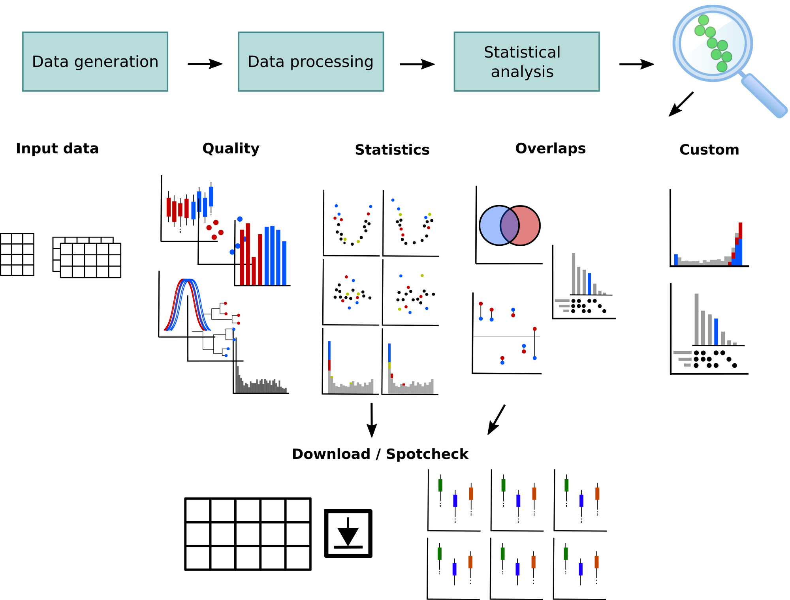

## Introduction

OmicLoupe is a software used for interactive exploration of omics-datasets. It provides an extensive set of visualizations designed to explore quality issues and biological and technical trends rapidly. It also provides visualizations aiming to make it easy to compare how gene products behave across multiple datasets.

It was developed at the Department of Immunotechnology by Jakob Willforss, with great input from Valentina Siino and Fredrik Levander.

## Availability

The source code and instructions for performing a local installation are present on <a href="https://github.com/ComputationalProteomics/OmicLoupe" target="_blank">GitHub</a>.

An <a href="https://omicloupe.serve.scilifelab.se/" target="_blank">OmicLoupe web server</a> hosted at SciLifeLab is available. Test data can be downloaded from [here](https://github.com/ComputationalProteomics/OmicLoupe/releases/download/1.0.0/example_data.zip).

## Reference

A manuscript describing the software is published in BMC Bioinformatics <a href="https://doi.org/10.1186/s12859-021-04043-5" target="_blank">here</a>. Please cite if you use OmicLoupe in your work:  
Willforss, J., Siino, V. & Levander, F. OmicLoupe: facilitating biological discovery by interactive exploration of multiple omic datasets and statistical comparisons. BMC Bioinformatics 22, 107 (2021). https://doi.org/10.1186/s12859-021-04043-5

## Contact

If you run into any issues or have further questions - feel free to contact us on jakob (at) jakobwillforss (dot) com or fredrik (dot) levander (at) immun (dot) lth (dot) se. In particular, if you run into issues with the software or have suggestions from a user perspective - we would be happy to hear your thoughts! Input like this helps us improve OmicLoupe for future users.

## Tutorial videos

Video tutorials explaining and demonstrating the use of OmicLoupe are available at <a href="https://www.youtube.com/playlist?list=PLUSAOuk3pSE3r5YiGbxUck3Hr4SFeHS1T" target="_blank">YouTube</a>:

<iframe width="560" height="315" src="https://www.youtube.com/embed/videoseries?list=PLUSAOuk3pSE3r5YiGbxUck3Hr4SFeHS1T" frameborder="0" allow="accelerometer; autoplay; clipboard-write; encrypted-media; gyroscope; picture-in-picture" allowfullscreen></iframe>
